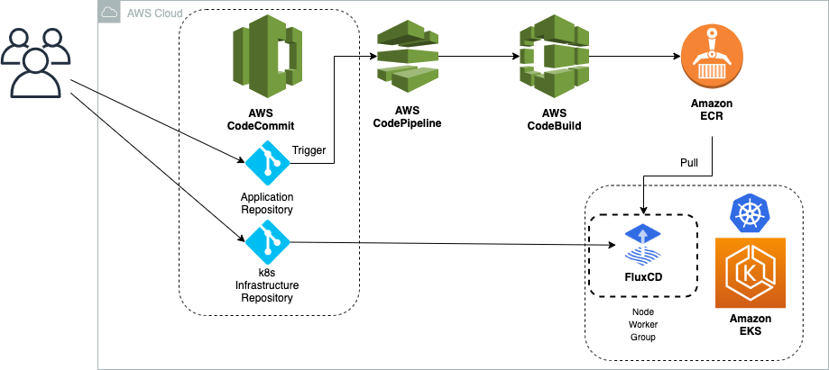
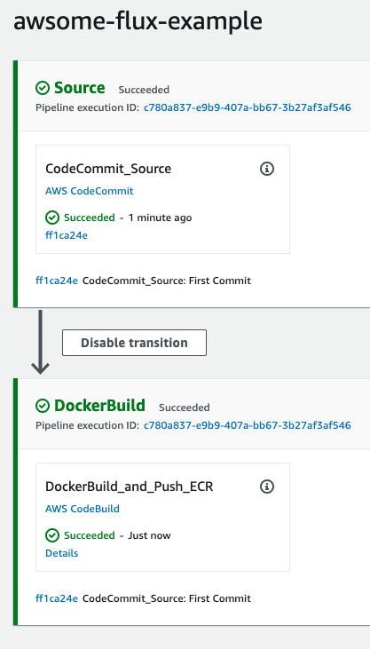

## CI/CD on EKS using AWS Codecommit, AWS Codepipeline, AWS Codebuild and FluxCD written in python using CDK!
The purpose of this repository is to demo how can we work with the GitOps philosophy using FluxCD on EKS. This implementation has been developed using CDK.

#### Requirements
  - CDK installed: [Getting started with the AWS CDK](https://docs.aws.amazon.com/cdk/latest/guide/getting_started.html)
  - AWS Account
  - IAM user with Git Credentials for Codecommit: [IAM Git Credentials](https://docs.aws.amazon.com/IAM/latest/UserGuide/id_credentials_ssh-keys.html)


### Architecture


###  Steps to reproduce

Export your Git credentials:
```
export GIT_AUTH_USER=git_username
export GIT_AUTH_KEY=git_credentials
```
Specify the stack name, and region on the [cdk.json](cdk.json), for example:

```
{
  "app": "python3 app.py",
  "context": {
    "@aws-cdk/core:enableStackNameDuplicates": "true",
    "aws-cdk:enableDiffNoFail": "true",
    "@aws-cdk/core:stackRelativeExports": "true",
    "@aws-cdk/aws-ecr-assets:dockerIgnoreSupport": true,
    "name": "awsome-flux-example",
    "region": "us-east-1"
  }
}

```

Deploy the infrastructure using the CDK cli:

```
cdk bootstrap aws://account_id/us-east-1
cdk deploy
```
The infrastructure creation takes around 15/20 min due the EKS cluster creation. During the meantime, you can clone the two new repos that have been already created and push the example code. First one for the kubernetes [infrastructure](repos/infra_example) and later, for your [application](repos/app_example). Don't forget to change the account ID of the Amazon Registry on the [infrastructure](repos/infra_example) in the line 21.

Like this:
```
git clone https://git-codecommit.us-east-1.amazonaws.com/v1/repos/kubernetes-infra-awsome-flux-example
cp repos/infra_example/* kubernetes-infra-awsome-flux-example/
git add .
git commit -am "First commit"
git push 

git clone https://git-codecommit.us-east-1.amazonaws.com/v1/repos/awsome-flux-example
cp repos/app_example/* awsome-flux-example/
git add .
git commit -am "First commit"
git push 
```

After push your code the pipeline is triggered:




Once the stack is completed, you will get the following outputs:
```
Outputs:
awsome-flux-example-stack.awsomefluxexampleclusterConfigCommandC5ACCB2F = aws eks update-kubeconfig --name awsomefluxexamplecluster7E1AB52B-8636fb0994a64eaf835a8568e4f1dd6d --region us-east-1 --role-arn arn:aws:iam::account_id:role/awsome-flux-example-stack-awsomefluxexamplecluster-4WYAIKEQONYC
awsome-flux-example-stack.awsomefluxexampleclusterGetTokenCommand58A55459 = aws eks get-token --cluster-name awsomefluxexamplecluster7E1AB52B-8636fb0994a64eaf835a8568e4f1dd6d --region us-east-1 --role-arn arn:aws:iam::account_id:role/awsome-flux-example-stack-awsomefluxexamplecluster-4WYAIKEQONYC
awsome-flux-example-stack.awsomefluxexamplefluxcdk8sinfrastructurerepository051BF5A3 = https://git-codecommit.us-east-1.amazonaws.com/v1/repos/kubernetes-infra-awsome-flux-example
```

### Check your cluster

Connect to the EKS cluster using the previous output and check your application. You can also follow [Update Kubeconfig](https://docs.aws.amazon.com/cli/latest/reference/eks/update-kubeconfig.html)

```
# kubectl get pod
NAME                               READY   STATUS    RESTARTS   AGE
awsome-app-flux-67b6457b5b-fhz7m   1/1     Running   0          5m12s
awsome-app-flux-67b6457b5b-ngxhb   1/1     Running   0          5m33s
flux-f8c9c99f9-k9wd4               1/1     Running   0          15m
memcached-5bd7849b84-26xrv         1/1     Running   0          15m
```


###  Clean up
After completing your demo, delete your stack using the CDK cli:
```
cdk destroy
```

## Security

See [CONTRIBUTING](CONTRIBUTING.md#security-issue-notifications) for more information.

## License

This library is licensed under the MIT-0 License. See the LICENSE file.